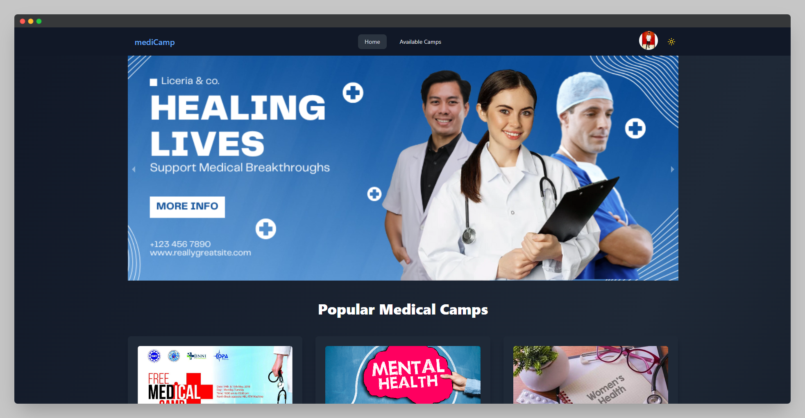
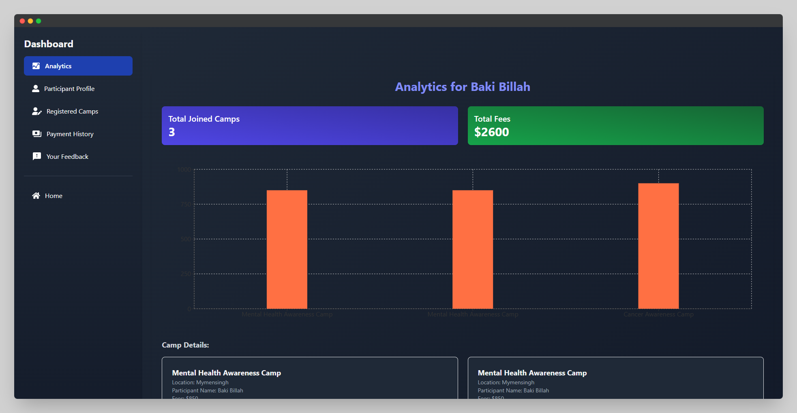
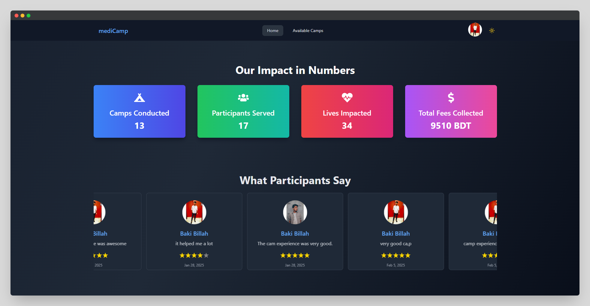

# 🏥 MediCamp - Medical Camp Management System (MCMS)

**MediCamp** is a comprehensive **Medical Camp Management System (MCMS)** built with the **MERN stack** to streamline the management of medical camps. This platform empowers organizers and participants to efficiently coordinate and manage medical camps while ensuring a seamless user experience.

## 🌐 Live Preview

- **Client-Side:** [MediCamp Web App](https://medicamp-76a03.web.app/)
- **Server-Side API:** [MediCamp Server](https://medi-camp-server-one.vercel.app)

---

## 🖼 Screenshot

  
  
  

---

## ✨ Features

### 📋 **Camp Management**
- **Camp Details Page:** Displays information like name, image, fees, date, time, location, healthcare professionals, and participant count.
- **Available Camps Page:** Lists all camps with sorting (Most Registered, Fees) and a search bar.
- **Watchlist & Registration:** Users can join camps with a simple registration process.

### 🎯 **Organizer Dashboard**
- **Profile Management:** Update name, image, and contact details.
- **Add & Manage Camps:** Add, edit, and delete medical camps.
- **Manage Registrations:** View participants, payment status, and approve/cancel registrations.

### 📊 **Participant Dashboard**
- **Interactive Analytics:** View participation stats with visual charts.
- **Profile & Registered Camps:** Manage personal details and registered camps.
- **Payment & History:** Secure Stripe payments with a complete payment history.
- **Feedback & Ratings:** Leave feedback after a camp, visible to other users.

### 🔐 **Authentication & Authorization**
- **User Roles:** Organizers and Participants with role-based access.
- **JWT Authentication:** Secure access to protected routes.
- **Social Login:** Google authentication for quick sign-ups.

### 🚀 **Enhanced User Experience**
- **Pagination & Search:** Easily browse and filter camps.
- **Sweet Alerts & Toast Notifications:** Real-time feedback on actions.
- **Dark Mode Support:** Seamless light/dark mode switching.

---

## 🛠 Tech Stack

### **Frontend:**
- React 18
- React Router
- Tailwind CSS & DaisyUI
- Framer Motion (Animations)
- React Query (Efficient data fetching)
- React Hook Form (Form validation)

### **Backend & Database:**
- Node.js & Express.js
- MongoDB & Mongoose
- Firebase Authentication
- Stripe Payment Integration

### **Development & Tools:**
- Vite (Fast build tool)
- ESLint (Code quality & linting)
- React Toastify (User notifications)
- LocalForage (Client-side caching)

---

## 🚀 Installation & Setup

### **Prerequisites**
Ensure you have **Node.js** and **npm** installed.

### **Steps to Run Locally**

1️⃣ **Clone the Repository**
```bash
git clone https://github.com/your-username/medicamp.git
cd medicamp
````

2️⃣ **Install Dependencies**
```bash
npm install
```

3️⃣ **Start the Development Server**
```bash
npm run dev
```

The app should be running on **http://localhost:5173/**.

---

## 🔑 Environment Variables

Create a `.env` file in the root directory and add the following:

```plaintext
VITE_apiKey=YOUR_FIREBASE_API_KEY
VITE_authDomain=YOUR_FIREBASE_AUTH_DOMAIN
VITE_projectId=YOUR_FIREBASE_PROJECT_ID
VITE_storageBucket=YOUR_FIREBASE_STORAGE_BUCKET
VITE_messagingSenderId=YOUR_FIREBASE_MESSAGING_SENDER_ID
VITE_appId=YOUR_FIREBASE_APP_ID
```

⚠️ **Never expose your Firebase credentials in public repositories!**
